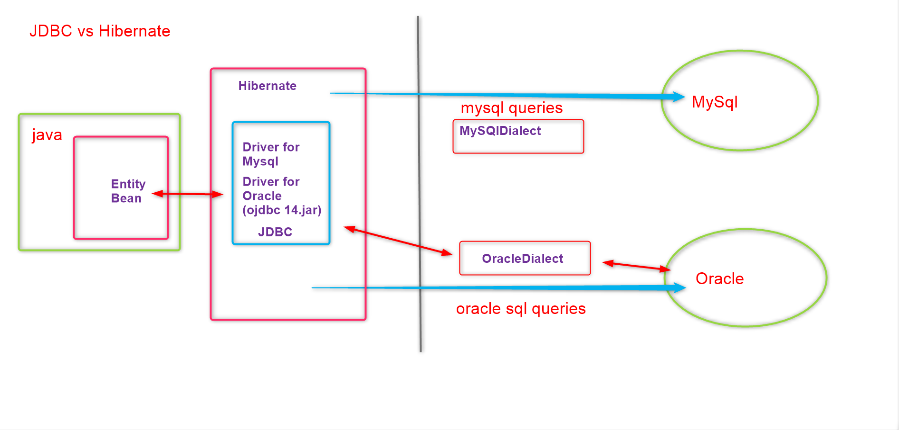

:books: **Hibernate**

:electron: **Getting Started**

`Hibernate ?`
>Hibernate ORM enables developers to more easily write applications whose data outlives the application process. As an Object/Relational Mapping (ORM) framework, Hibernate is concerned with data persistence as it applies to relational databases (via JDBC). 

`Advantages`
* Reduces bolier-plate jdbc code
* Hibernate can automatically create table based on the Java Object (Entity Bean)
* Help you switch databases, as it generates the database specific queries

`Architecture`  


`jdb vs hibernate`


:lock:  **CRUD with HIBERNATE**  

:one: Configure the hibernate libraries

-http://sourceforge.net/projects/hibernate/files/hibernate4/4.2.21.Final/hibernate-release-4.2.21.Final.zip/download

- copy jar from
  - hibernate-release-4.2.21.Final\hibernate-release-4.2.21.Final\lib\required
- to 
  - lib folder

:two: Create the Entity

``` Java
package com.domain.model;

public class Product {
	private String productId;
	private String productName;

	public Product() {
	}

	public String getProductId() {
		return productId;
	}

	public String getProductName() {
		return productName;
	}

	public void setProductId(String productId) {
		this.productId = productId;
	}

	public void setProductName(String productName) {
		this.productName = productName;
	}

	@Override
	public String toString() {
		return "Product [productId=" + productId + ", productName=" + productName + "]";
	}
}
```

:three: Create Hibernate Configuration File

```xml
<?xml version="1.0" encoding="UTF-8"?>
<!DOCTYPE hibernate-configuration PUBLIC
		"-//Hibernate/Hibernate Configuration DTD 3.0//EN"
		"http://www.hibernate.org/dtd/hibernate-configuration-3.0.dtd">
<hibernate-configuration>
	<session-factory>
		<property name="hibernate.connection.driver_class">oracle.jdbc.driver.OracleDriver</property>
		<property name="hibernate.connection.url">jdbc:oracle:thin:@localhost:1521:xe</property>
		<property name="hibernate.connection.username">hr</property>
		<property name="hibernate.connection.password">hr</property>
		<property name="hibernate.dialect">org.hibernate.dialect.Oracle10gDialect</property>

		<property name="hibernate.show_sql">true</property>
		<property name="hibernate.hbm2ddl.auto">update</property>
		<mapping resource="com/domain/model/Product.hbm.xml" />
	</session-factory>
</hibernate-configuration>
```

:four: Configure Hibernate Mapping (for model)

``` xml
<?xml version="1.0"?>
<!DOCTYPE hibernate-mapping PUBLIC "-//Hibernate/Hibernate Mapping DTD 3.0//EN"
"http://hibernate.sourceforge.net/hibernate-mapping-3.0.dtd">
<!-- Generated 5 Mar, 2020 8:50:07 AM by Hibernate Tools 3.5.0.Final -->
<hibernate-mapping>
       <class name="com.domain.model.Product" table="PRODUCTS">
        <id name="productId" type="java.lang.String">
            <column name="PRODUCT_ID" />
            <generator class="assigned" />
        </id>
        <property name="productName" type="java.lang.String">
            <column name="PRODUCT_NAME" />
        </property>
    </class>
</hibernate-mapping>

https://docs.jboss.org/hibernate/orm/3.3/reference/en/html/mapping.html
https://docs.jboss.org/hibernate/stable/core.old/reference/en/html/mapping-types.html
```
:five: **Craete a Singleton Session Factory**

``` java
package com.domain.util;

import org.hibernate.HibernateException;
import org.hibernate.SessionFactory;
import org.hibernate.cfg.Configuration;
import org.hibernate.service.ServiceRegistry;
import org.hibernate.service.ServiceRegistryBuilder;

public class HibernateUtilities {
	private static ServiceRegistry serviceRegistry;
	private static SessionFactory sessionFactory;

	public static SessionFactory getSessionFactory() {
		return sessionFactory;
	}
	static {
		try {
			Configuration configuration = new Configuration().configure();
			serviceRegistry = new ServiceRegistryBuilder().applySettings(configuration.getProperties())
					.buildServiceRegistry();
			sessionFactory = configuration.buildSessionFactory(serviceRegistry);
		} catch (HibernateException exception) {
			System.out.println("ERROR : Creating Session Factory!");
			System.out.println(exception);
		}
	}
}
```

:beetle: Caused by: java.lang.ClassNotFoundException: Could not load requested class : oracle.jdbc.driver.OracleDriver
> add ojdbc14.jar to classpath

:six: **Create the Application Class and perform Crud operations**

``` java
package com.domain;

import java.io.IOException;
import java.util.List;

import org.hibernate.Query;
import org.hibernate.Session;
import org.hibernate.SessionFactory;

import com.domain.model.Product;
import com.domain.util.HibernateUtil;


public class Application1 {
	// Create the session factory
	static SessionFactory sessionFactory = HibernateUtil.getSessionFactory();
	Session session = sessionFactory.openSession();

	public static void main(String[] args) {
		Application1 application = new Application1();
		application.saveProduct();
		application.getProducts();
		//application.getProducts();
		//application.getProduct("P02");
		//application.updateProduct("P02", "mongoose");
		//application.deleteProduct("P02");
		//sessionFactory.close();
		try {
			System.in.read();
		} catch (IOException e) {
		}
		finally {
			sessionFactory.close();
		}
	}

	private void getProduct(String productId) {
		session.beginTransaction();
		Product product = (Product) session.get(Product.class, productId);  
		System.out.println(product);
		session.getTransaction().commit();
	}
	private void getProducts() {
		session.beginTransaction();
		Query selectQuery = session.createQuery("FROM Product");
		List<Product> Products = (List<Product>) selectQuery.list();
		session.getTransaction().commit();
		for (Product Product : Products) {
			System.out.println(Product);
		}
	}

	private void saveProduct() {
		session.beginTransaction();
		Product product = new Product();
		product.setProductId("P04");
		product.setProductName("angular");
		session.save(product);
		session.getTransaction().commit();
		
		session.beginTransaction();
		Product product1 = new Product();
		product1.setProductId("P05");
		product1.setProductName("angular");
		session.save(product1);
		session.getTransaction().commit();
	}

	private void updateProduct(String productId, String productName) {
		session.beginTransaction();
		Product Product = (Product) session.get(Product.class, productId);  
		Product.setProductName(productName);
		session.getTransaction().commit();
	}

	private void deleteProduct(String productId) {
		session.beginTransaction();
		Product Product = (Product) session.get(Product.class, productId);
		session.delete(Product);
		session.getTransaction().commit();
	}
}
```
:beetle: **Bugs**
Caused by: java.sql.SQLException: ORA-00001: unique constraint (HR.SYS_C007034) violated
> Entity with ID already exists